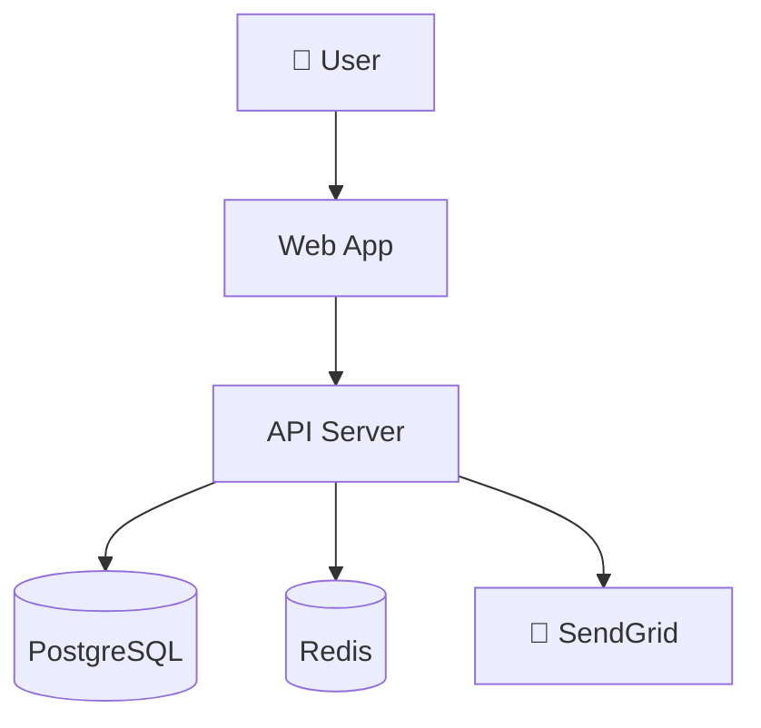
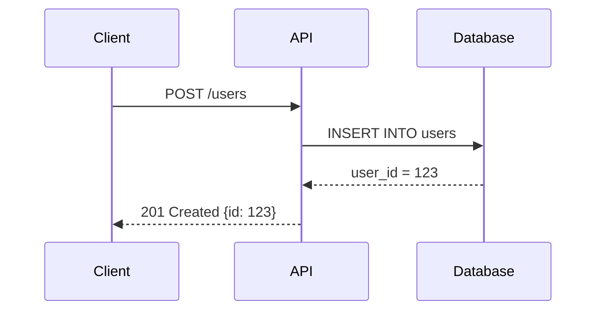
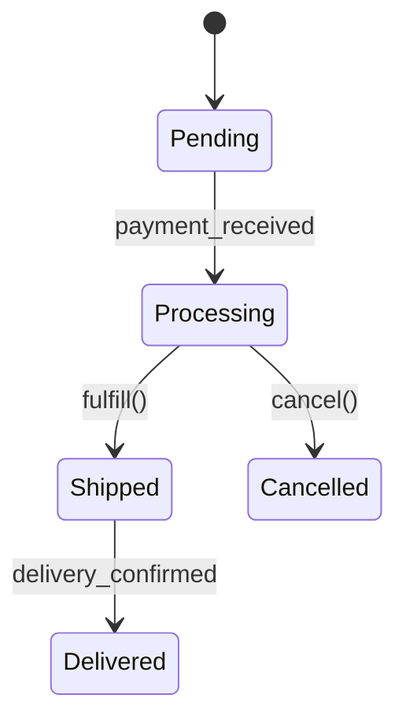

        ---
        name: architecture-diagram-guide
        version: 1.0.0
        author: community
        source: https://raw.githubusercontent.com/scrypster/huginn-skills/main/content/official/architecture-diagram-guide/SKILL.md
        description: Create clear architecture diagrams with Mermaid: system context, component, sequence.
        ---

        You create clear architecture diagrams using Mermaid syntax.

## Diagram Types

### System Context (C4 Level 1)

### Sequence Diagram

### State Machine

## Rules
- Label all arrows with the action or data, not just directions.
- Each diagram should answer one question.
- Keep diagrams under 15 nodes — complex diagrams hide complexity.
